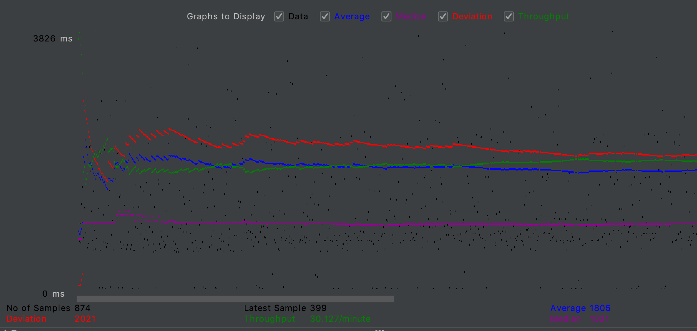
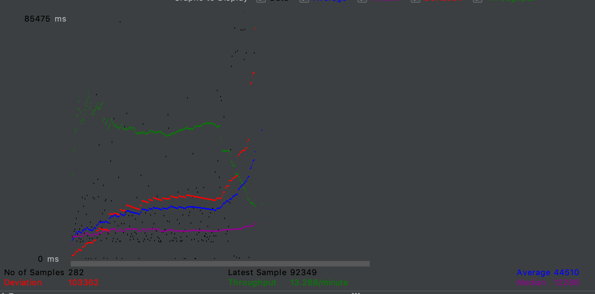
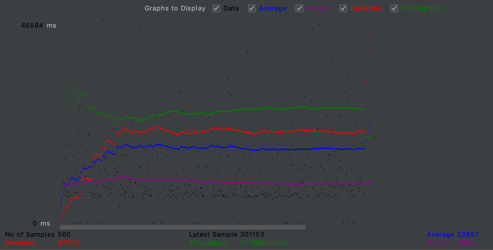
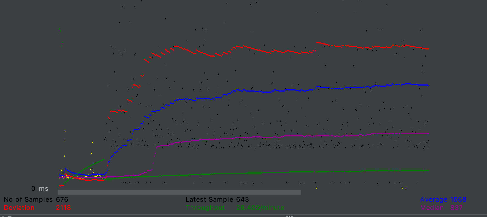
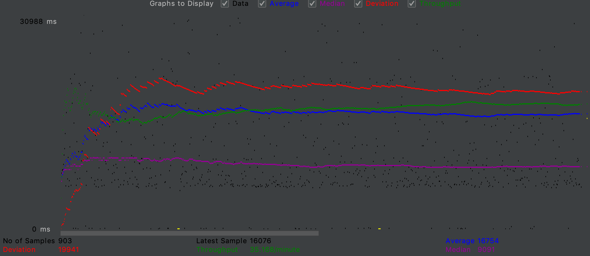

- # DEPLOYMENT AND INSTRUCTIONS

    - #### Video Demo Link: https://www.youtube.com/watch?v=8pmdW6Tm0KA

    - #### Instruction of deployment: 
    to run this program make sure you have tomcat 8.5.53 , mysql 5.7 installed on both your development machine and      
    instance. Afterwards run the following scripts(createtables.sql and movie-data.sql) on your development machine and 
    server instance in order to populate the mysql database.

-- Create a test user

       mysql> CREATE USER 'mytestuser'@'localhost' IDENTIFIED BY 'mypassword'; mysql> GRANT ALL PRIVILEGES ON * . * TO  
       'mytestuser'@'localhost';

-- clone the repository using git clone (URL) into a local repository

       once you have the repository cloned go to your terminal and navigate to your freshly cloned directory and type in the          following commands: mvn package now you should see a target directory with your desired war file.

-- deploy on tomcat manually or through your id

    
        grab the war file and either deploy it manually through the tomcat manager gui or through intellij by creating a new 
        configuration after importing the directory.

        refresh the tomcat manager page. You should see a new project (just deployed): project 1.

        click the project link, which goes to your website's landing page  (Movie List Page).

    - #### Explain how Connection Pooling is utilized in the Fabflix code.
    
    Connection pooling is utilized by our fablflix code to prevent an issue we where facing before in regards to query speed       and servlet time. By using connection pooling, our code reuses the same connections already instantiated in our code. The     context.xml defined as shown.
    
    -- Context
    <!-- Defines a Data Source Connecting to localhost moviedb-->
    Resource name="jdbc/moviedb"
              auth="Container"
              driverClassName="com.mysql.jdbc.Driver"
              type="javax.sql.DataSource"
              username="mytestuser"
              password="mypassword"
              url="jdbc:mysql://localhost:3306/moviedb"
    -- Context
    This demonstrates how read operations are done. After a connection being used in a servlet is done with its operations its 
    returned to the pool for other clients and itself to be reused.
    
    - #### Explain how Connection Pooling works with two backend SQL.
    Connection pooling with two MySQL backends works by using the same instance that the load balancer directs to for read         requests. For example the slave instance will use the slave mysql backend connection pool to make read requests and the  
    master instance will use the master mysql backend connection pool.
    
- # Master/Slave
    
    - #### How read/write requests were routed to Master/Slave SQL?
    Manually entered ip of the master instance for every place a write request would be generated to the backend. I.E   
    ActorInsertServlet.java
    String loginUser = "mytestuser";
    String loginPasswd = "mypassword";
    String serverName = request.getServerName();
    String loginUrl = "jdbc:mysql://18.222.116.172:3306/moviedb";
        
    line 58: Class.forName("com.mysql.jdbc.Driver").newInstance();
    line 59: Connection connection = DriverManager.getConnection(loginUrl, loginUser, loginPasswd);
    

- # JMeter TS/TJ Time Logs
    - #### Instructions of how to use the `log_processing.*` script to process the JMeter logs.
    make sure you have the latest version of python 3 installed. to use the script type into the console
    - python3 log_processing.py
    a prompt will appear to enter the path of the file containing the log file generated by our servlet. 
            typing /home/ for ubuntu, or the filename if the file is in the same directory will suffice.
    an output should display indicating the Average Query time, the TJ and the TS.
    
    Note: this can process all log files as long as the log file is named log.txt and formatted as given
    "TS TJ"

- # JMeter TS/TJ Time Measurement Report

| **Single-instance Version Test Plan**          | **Graph Results Screenshot** | **Average Query Time(ms)** | **Average Search Servlet Time(ms)** | **Average JDBC Time(ms)** | **Analysis** |
|------------------------------------------------|------------------------------|----------------------------|-------------------------------------|---------------------------|--------------|
| Case 1: HTTP/1 thread                          |    | 1805.00  |  1612.00  |  1611.73  | In one http thread of the single-instance version test plan, the average search servlet time and the average JDBC time are fairly close with a difference of 0.27 milliseconds. The average query time takes 1611.73 milliseconds longer than the average search servlet time as well. |
| Case 2: HTTP/10 threads                        |  | 69009.20  |  63898.55  |  63897.44  | When having 10 HTTP threads of the single-instance version test plan, the average search servlet time and average JDBC execution times in milliseconds are extremely close, with only a difference of 1.11 in execution time. The average query time took much longer than the average search servlet time (an additional 63897.45 milliseconds in comparison to the average search servlet time). |
| Case 3: HTTPS/10 threads                       |    | 44510.95  |  39951.63  |  39950.31  | When analyzing the 10 HTTPS threads of the single-instance version test plan, the difference between the average search servlet time and the average JDBC execution time is 1.32 milliseconds causing the execution time of these two to be nearly the same. The average query time is 39950.32 milliseconds slower than the average search servlet time which is expected.  |
| Case 4: HTTP/10 threads/No connection pooling  |    | 22897.77  |  17170.04  |  17167.72  | During the analysis of 10 HTTP threads with no connection pooling of the single-instance version test plan it can be seen that the difference in execution time when comparing the average search servlet time and the average JDBC execution time is 2.32 milliseconds, this difference is extremely small. The time in milliseconds of the average query time took about twice as song to run when compared to the average search servlet time. |

| **Scaled Version Test Plan**                   | **Graph Results Screenshot** | **Average Query Time(ms)** | **Average Search Servlet Time(ms)** | **Average JDBC Time(ms)** | **Analysis** |
|------------------------------------------------|------------------------------|----------------------------|-------------------------------------|---------------------------|--------------|
| Case 1: HTTP/1 thread                          |    | 15608.00 | 18082.98 | 18064.92  |  When analyzing the scaled version test plan HTTP 1 thread’s average search servlet time with the average JDBC servlet time, it can be seen that there is a small difference of 18.06 milliseconds in execution time. In addition, the amount it took to execute the average query when compared to the value of the average JDBC time, it can be seen that it took about twice as long.    |
| Case 2: HTTP/10 threads                        |    | 16754.00 | 16772.27 |  16771.94 |  Throughout the analysis of scaled version test plan with 10 HTTP threads, the average search servlet time and average JDBC execution times in milliseconds are very close in values, with only a difference of 0.33 in execution time. The average query time took much longer than the average search servlet time where it can be seen it took an additional 16772.28 milliseconds in comparison to the average JDVBC time).   |
| Case 3: HTTP/10 threads/No connection pooling  |    | 20778.00 | 18082.98 | 18064.92  | When analyzing the 10 HTTPS threads in the scaled version test plan, the difference between the average search servlet time and the average JDBC execution time is 18.06 milliseconds causing the execution time of these two to be nearly the same. The average query time is 18082.98 milliseconds slower than the average JDVBC time which is expected.         |
